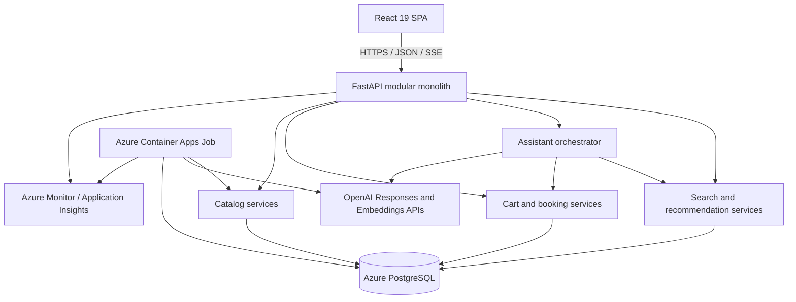

# Intelligent Tourism E-Ticket Shopping Assistant POC

**Status:** Implementation specification
**Target:** Proof of concept
**Last updated:** 2026-07-24
**Primary stack:** Python 3.14, FastAPI, React 19, Azure Database for PostgreSQL Flexible Server, pgvector, OpenAI API, Azure Container Apps

## 1. Executive summary

Build a web-based proof of concept for discovering and purchasing tourism products such as attraction tickets, tours, activities, transport passes, and vouchers.

The POC must demonstrate three connected capabilities:

1. **Hybrid product discovery:** users can search with keywords, natural language, and structured filters. PostgreSQL full-text search and pgvector semantic search are fused into one ranked result set.
2. **Modern recommendations:** users receive relevant, diverse recommendations based on destination, dates, party composition, session behavior, product similarity, popularity, availability, and stated preferences.
3. **Actionable shopping assistant:** users can turn any search into a conversation, refine requirements, compare products, check availability, and add a selected option to a cart. A simulated checkout proves the complete flow without integrating a real payment provider.

The POC intentionally uses a small number of managed components:

- One modular FastAPI application.
- One React single-page application served by FastAPI.
- One Azure Database for PostgreSQL Flexible Server for transactional data, conversation state, full-text search, and vectors.
- One Azure Container App that can scale to zero.
- Azure Container Apps Jobs for catalog import and embedding generation.
- Direct OpenAI API integration through the Responses API.

No Redis, message broker, separate vector database, Azure AI Search, Kubernetes cluster, or microservice fleet is required for the POC.

## 2. Product vision

The experience should feel like a modern tourism marketplace rather than a chatbot attached to a catalog.

A user should be able to enter:

> Family-friendly things to do in Paris next Saturday afternoon for two adults and a 7-year-old. We prefer something indoors and want to spend under EUR 120.

The system should:

1. Extract destination, date, time of day, party composition, budget, indoor preference, and family suitability.
2. Show the extracted constraints as editable filter chips.
3. Retrieve products using lexical and semantic search.
4. Exclude products that cannot satisfy hard constraints.
5. Rank available products by relevance and contextual quality.
6. Explain why each leading result matches.
7. Let the user ask follow-up questions without losing search state.
8. Check live POC availability before an item is added to the cart.
9. Add a specific option, time slot, and participant mix to the cart.
10. Complete a simulated booking and issue a mock e-ticket/voucher.

## 3. Goals

### 3.1 Business goals

- Demonstrate that natural-language discovery improves long-tail tourism searches.
- Demonstrate recommendations before enough data exists for collaborative filtering.
- Demonstrate a grounded assistant that can complete shopping actions.
- Create an architecture that can evolve into a production marketplace.
- Measure relevance, assistant quality, latency, and AI cost.

### 3.2 Technical goals

- Support 10,000 experiences and at least 100,000 availability slots.
- Keep all search and recommendation retrieval in PostgreSQL.
- Use OpenAI Structured Outputs and strict function tools.
- Keep regular faceted search independent of an LLM whenever possible.
- Deploy as a scale-to-zero Azure Container App.
- Make model names, token limits, and recommendation weights configurable.
- Capture the behavioral events needed for future learned recommendation models.

### 3.3 POC success criteria

The POC is successful when all acceptance criteria in section 20 are met and the following journey works end to end:

```text
Natural-language request
  -> extracted constraints
  -> hybrid results
  -> conversational refinement
  -> product comparison
  -> availability selection
  -> add to cart
  -> simulated checkout
  -> mock voucher
```

## 4. Non-goals

The following are explicitly outside the POC:

- Real payment processing or PCI scope.
- Supplier settlement, commissions, invoicing, or reconciliation.
- Production-grade supplier connectivity.
- Dynamic pricing optimization.
- Refund processing or automated customer support.
- Native mobile applications.
- Multi-merchant checkout.
- A trained collaborative filtering, two-tower, or sequence model.
- A separate multi-agent architecture.
- Voice input.
- Production localization; the POC UI and indexed content are English-only.
- Production identity and customer account management.
- Real email or SMS delivery.
- High-availability or disaster-recovery deployment.

The design must not block these capabilities from being added later.

## 5. Domain scope

### 5.1 Supported product types

- Attraction admission.
- Guided tour.
- Activity or class.
- Day trip.
- Museum or cultural venue.
- Theme park.
- City or attraction pass.
- Transport ticket or pass.
- Food, cruise, or entertainment experience.
- Open-dated voucher.

### 5.2 Core domain concepts

| Concept | Description |
|---|---|
| Experience | Customer-facing tourism product shown in search results |
| Option | A bookable package within an experience, such as standard entry or guided entry |
| Availability slot | Date/time and remaining capacity for an option |
| Participant category | Adult, child, infant, senior, student, or other supported ticket type |
| Price | Amount for a participant category, option, and optionally slot |
| Voucher | Mock fulfillment artifact containing booking and redemption information |
| Destination | City or tourism area used for search and recommendations |
| Supplier | Organization providing the experience |
| Cart item | Selected experience option, slot, participant counts, and quoted price |
| Booking | Confirmed simulated order that produces a voucher |

### 5.3 Tourism-specific constraints

The discovery model and assistant must understand:

- Destination and distance from a point of interest.
- Visit date or date range.
- Time of day and duration.
- Party composition and participant ages.
- Budget, currency, and whether the budget is per person or total.
- Indoor/outdoor preference.
- Accessibility needs.
- Language.
- Instant confirmation.
- Free cancellation window.
- Mobile voucher acceptance.
- Meeting point.
- Skip-the-line access.
- Family suitability.
- Interest themes such as art, history, food, nature, nightlife, or adventure.
- Open-dated versus fixed-date tickets.

Hard constraints must never be silently relaxed. Soft preferences may be relaxed only when the UI or assistant states the trade-off.

## 6. Users and primary journeys

### 6.1 Anonymous shopper

- Searches and browses products.
- Uses filters.
- Starts or continues a conversation.
- Receives session-personalized recommendations.
- Adds products to the cart.
- Completes simulated checkout.

### 6.2 Catalog manager

- Imports or updates products from CSV or JSON.
- Reviews import errors.
- Triggers or observes embedding generation.
- Publishes or unpublishes an experience.
- Edits availability and capacity.

Manager functionality may be utilitarian. Recommendation and assistant quality take priority over a polished administration interface.

### 6.3 Required journeys

#### Journey A: traditional search

1. Search for `Louvre tickets`.
2. Receive exact lexical matches.
3. Filter by visit date, cancellation policy, and price.
4. Open a product and choose an available option.

#### Journey B: natural-language search

1. Search for `quiet indoor activities in Rome for grandparents on a hot afternoon`.
2. Receive extracted chips such as Rome, indoor, senior-friendly, afternoon, and low physical intensity.
3. Receive semantically relevant results even if those exact words are absent from product titles.

#### Journey C: conversational refinement

1. Start with a search result page.
2. Select **Ask the assistant**.
3. Ask `Which of these is best if one person uses a wheelchair?`
4. Receive a grounded comparison based on accessibility fields.
5. Ask `Only show ones with free cancellation`.
6. See the search result list and filter chips update.

#### Journey D: recommendation and booking

1. View an attraction in Paris.
2. Receive similar and complementary recommendations.
3. Ask the assistant for a half-day plan.
4. Select a recommended option and time slot.
5. Add it to the cart and complete simulated checkout.
6. Receive a mock QR voucher.

## 7. Functional requirements

### 7.1 Catalog

- Import a seed catalog from CSV or JSON.
- Upsert records by stable external ID.
- Validate required fields and report row-level errors.
- Publish only experiences that have:
  - Title and description.
  - Destination and coordinates.
  - Category.
  - At least one active option.
  - Valid price and currency.
  - Voucher and cancellation information.
- Generate one search document and one embedding per published experience.
- Regenerate the embedding only when embedding-relevant fields change.
- Retain an embedding model and version on each search document.
- Allow an experience to be unpublished without deleting historical events or bookings.

### 7.2 Search and browse

- Keyword and natural-language search through the same search box.
- Destination, date, time, category, price, rating, duration, accessibility, indoor/outdoor, language, instant confirmation, and free-cancellation filters.
- Sort by recommended, price, rating, duration, and popularity.
- Pagination or cursor-based loading.
- Search result cards with:
  - Image.
  - Title.
  - Destination.
  - Rating and review count.
  - Starting price and currency.
  - Duration.
  - Cancellation summary.
  - Availability indicator.
  - Match explanation.
- Search state must be serializable into a URL.
- Explicit UI filters override inferred natural-language filters.
- User exclusions must be persisted as hard constraints.

### 7.3 Recommendations

Provide these recommendation placements:

1. **For you:** session-personalized experiences on the home page.
2. **Similar experiences:** alternatives on a product page.
3. **You may also like:** complementary products based on destination and trip context.
4. **Because you searched for:** recommendations based on current query and filters.
5. **Complete your day:** complementary products that do not overlap selected booking times.

Each response must contain a reason code and a customer-facing reason, for example:

- `SIMILAR_INTERESTS`: Similar art and history experience.
- `NEARBY`: Close to another product in your cart.
- `FITS_PARTY`: Suitable for children in your party.
- `AVAILABLE_ON_DATE`: Available on your selected date.
- `COMPLEMENTARY_CATEGORY`: A complementary evening activity.
- `TRENDING_DESTINATION`: Popular in your selected destination.

### 7.4 Shopping assistant

- Continue from current search, filters, selected products, and cart.
- Extract and maintain structured constraints.
- Ask at most one clarification question at a time.
- Ask only when the answer is likely to materially change recommendations.
- Search, compare, check availability, recommend complements, and update the cart through typed tools.
- Return structured UI elements in addition to prose.
- State when no exact result exists.
- Distinguish hard constraints from preferences.
- Explain any relaxed preference.
- Never invent product, price, policy, availability, or accessibility facts.
- Require explicit user confirmation before simulated checkout.
- Limit the tool loop to three tool execution rounds per user message.

### 7.5 Cart and simulated checkout

- Add a specific option and slot with participant counts.
- Revalidate capacity and price when adding to the cart.
- Revalidate again at checkout.
- Prevent incompatible participant counts.
- Calculate subtotal and total in one currency.
- Reject mixed-currency carts in the POC.
- Create a simulated booking.
- Generate a voucher ID, QR payload, and redemption instructions.
- Make add-to-cart and checkout idempotent.

### 7.6 Behavioral event capture

Capture:

- `search_submitted`
- `search_results_viewed`
- `filter_applied`
- `experience_impression`
- `experience_viewed`
- `recommendation_impression`
- `recommendation_clicked`
- `assistant_message_sent`
- `assistant_product_shown`
- `assistant_action_clicked`
- `availability_checked`
- `cart_item_added`
- `cart_item_removed`
- `checkout_started`
- `booking_completed`

Every event must include an anonymous session ID, timestamp, source placement, and relevant experience IDs. Do not place message text or personal information in general analytics payloads.

## 8. Technical architecture



### 8.1 Architecture decisions

| Decision | POC choice | Reason |
|---|---|---|
| Backend | Python 3.14 and FastAPI | Fast implementation, strong AI ecosystem, adequate I/O scalability |
| Frontend | React 19 with TypeScript | Modern component and streaming support |
| Packaging | One deployable application image | Lowest infrastructure and operational cost |
| Database | Azure PostgreSQL Flexible Server | Transactions, FTS, JSONB, vectors, and analytics in one service |
| Vector search | pgvector | Avoid a separate vector service |
| Lexical search | PostgreSQL full-text search | Sufficient for POC scale and hybrid retrieval |
| LLM API | OpenAI Responses API | Structured outputs and tool calling |
| Default model | `gpt-5.4-mini` | Cost-efficient assistant and intent extraction |
| Optional evaluation model | `gpt-5.6` | Quality comparison only; not default runtime routing |
| Embeddings | `text-embedding-3-small`, 512 dimensions | Low generation, storage, memory, and index cost |
| Background processing | Azure Container Apps Jobs | Pay only while imports or embeddings run |
| Session state | PostgreSQL | Avoid Redis for POC |
| Deployment | Azure Container Apps Consumption plan | Scale to zero and usage billing |

Model identifiers must be configuration values. A model can be replaced after evaluation without a code change.

### 8.2 Modular backend boundaries

```text
app/
  api/
  assistant/
  bookings/
  cart/
  catalog/
  common/
  events/
  recommendations/
  search/
  users/
```

Modules must communicate through service interfaces rather than reaching into one another's database implementation.

## 9. Data model

Use UUID primary keys unless a table is append-only and benefits from a bigint key. Store timestamps in UTC using `timestamptz`.

### 9.1 Catalog tables

#### `suppliers`

- `id`
- `external_id`
- `name`
- `status`
- `created_at`
- `updated_at`

#### `destinations`

- `id`
- `slug`
- `name`
- `country_code`
- `latitude`
- `longitude`
- `timezone`

#### `experiences`

- `id`
- `external_id`
- `supplier_id`
- `destination_id`
- `slug`
- `title`
- `short_description`
- `description`
- `category`
- `subcategories text[]`
- `interest_tags text[]`
- `indoor_outdoor`
- `duration_minutes`
- `latitude`
- `longitude`
- `meeting_point`
- `languages text[]`
- `accessibility_features text[]`
- `minimum_age`
- `family_friendly`
- `instant_confirmation`
- `mobile_voucher`
- `rating`
- `review_count`
- `popularity_score`
- `status`
- `published_at`
- `created_at`
- `updated_at`

#### `experience_options`

- `id`
- `experience_id`
- `external_id`
- `name`
- `description`
- `validity_type`: `FIXED_SLOT`, `FIXED_DATE`, or `OPEN_DATED`
- `confirmation_type`
- `cancellation_policy_code`
- `free_cancellation_hours`
- `max_party_size`
- `active`
- `created_at`
- `updated_at`

#### `option_prices`

- `id`
- `option_id`
- `participant_type`
- `currency`
- `amount`
- `minimum_age`
- `maximum_age`

#### `availability_slots`

- `id`
- `option_id`
- `starts_at`
- `ends_at`
- `capacity_total`
- `capacity_remaining`
- `status`
- `price_override jsonb`
- `updated_at`

#### `experience_media`

- `id`
- `experience_id`
- `url`
- `alt_text`
- `sort_order`

### 9.2 Search tables

#### `experience_search_documents`

- `experience_id` primary key
- `document_text`
- `search_vector tsvector`
- `embedding vector(512)`
- `embedding_model`
- `embedding_version`
- `content_hash`
- `embedded_at`
- `updated_at`

`document_text` must be generated deterministically from:

```text
title
destination
category and subcategories
interest tags
short description
description
indoor/outdoor
accessibility
languages
voucher type
cancellation summary
```

Do not include volatile fields such as capacity or current price in the embedding text.

### 9.3 Session and event tables

#### `shopping_sessions`

- `id`
- `anonymous_id`
- `currency`
- `destination_id`
- `visit_start`
- `visit_end`
- `party jsonb`
- `preference_state jsonb`
- `interest_embedding vector(512)` nullable
- `created_at`
- `last_seen_at`

#### `behavior_events`

- `id bigint`
- `session_id`
- `event_type`
- `experience_id` nullable
- `placement` nullable
- `query_id` nullable
- `properties jsonb`
- `occurred_at`

Retain raw events for the POC. A production design should add lifecycle and retention policies.

### 9.4 Conversation tables

#### `conversations`

- `id`
- `session_id`
- `status`
- `state jsonb`
- `summary`
- `created_at`
- `updated_at`

#### `conversation_messages`

- `id bigint`
- `conversation_id`
- `role`
- `content`
- `structured_payload jsonb`
- `openai_response_id` nullable
- `input_tokens` nullable
- `output_tokens` nullable
- `estimated_cost` nullable
- `created_at`

### 9.5 Commerce tables

#### `carts`

- `id`
- `session_id`
- `currency`
- `status`
- `version`
- `created_at`
- `updated_at`

#### `cart_items`

- `id`
- `cart_id`
- `experience_id`
- `option_id`
- `slot_id` nullable
- `participants jsonb`
- `unit_prices jsonb`
- `quantity`
- `quoted_total`
- `quote_expires_at`
- `created_at`
- `updated_at`

#### `bookings`

- `id`
- `cart_id`
- `booking_reference`
- `status`
- `currency`
- `total`
- `customer_details jsonb`
- `confirmed_at`

#### `vouchers`

- `id`
- `booking_id`
- `voucher_reference`
- `qr_payload`
- `redemption_instructions`
- `valid_from`
- `valid_until`
- `created_at`

### 9.6 Required PostgreSQL extensions and indexes

```sql
CREATE EXTENSION IF NOT EXISTS vector;
CREATE EXTENSION IF NOT EXISTS pg_trgm;
CREATE EXTENSION IF NOT EXISTS unaccent;
```

Required indexes:

```sql
CREATE INDEX ix_experience_search_fts
ON experience_search_documents
USING GIN (search_vector);

CREATE INDEX ix_experience_search_embedding_hnsw
ON experience_search_documents
USING hnsw (embedding vector_cosine_ops);

CREATE INDEX ix_experiences_destination_status
ON experiences (destination_id, status);

CREATE INDEX ix_slots_option_start_status
ON availability_slots (option_id, starts_at, status);

CREATE INDEX ix_events_session_time
ON behavior_events (session_id, occurred_at DESC);
```

Create the HNSW index after the initial catalog load. For a very small catalog, benchmark exact vector search before enabling HNSW.

## 10. Natural-language intent model

### 10.1 Search intent schema

The intent extraction call must use Structured Outputs and return:

```json
{
  "search_text": "museum and art activities",
  "destination": {
    "name": "Paris",
    "confidence": 0.99
  },
  "visit_window": {
    "start": "2026-07-25T12:00:00+02:00",
    "end": "2026-07-25T18:00:00+02:00"
  },
  "party": [
    {"type": "adult", "count": 2},
    {"type": "child", "count": 1, "age": 7}
  ],
  "budget": {
    "amount": 120,
    "currency": "EUR",
    "scope": "total"
  },
  "hard_constraints": [
    {"field": "indoor_outdoor", "operator": "eq", "value": "indoor"}
  ],
  "soft_preferences": [
    {"field": "family_friendly", "value": true, "weight": 0.9}
  ],
  "exclusions": [],
  "sort": "recommended",
  "needs_clarification": false,
  "clarification_question": null
}
```

### 10.2 Constraint rules

- UI-selected filters are authoritative.
- Explicit user statements override previously inferred values.
- Later user statements override earlier statements unless the user asks to compare alternatives.
- Dates must be resolved in the destination's timezone.
- Relative dates must use the current request date supplied by the backend.
- Budget must distinguish total from per-person.
- Age-sensitive products must use participant ages when provided.
- Unknown values remain null; the model must not guess.
- Hard constraints, exclusions, and safety/accessibility requirements cannot be converted into preferences.

### 10.3 LLM bypass

Do not call the intent model when all of these are true:

- The query is empty or a short navigational keyword query.
- All constraints are already represented by UI filters.
- No date, party, budget, comparative, or conversational language is present.

Examples that bypass the LLM:

- `Louvre`
- `city pass`
- category click followed by UI filters

This is a major cost and latency optimization.

## 11. Hybrid search

### 11.1 Candidate retrieval

Run lexical and semantic retrieval in parallel within one SQL query:

- Lexical: weighted PostgreSQL full-text rank using title, destination, category, tags, and description.
- Semantic: cosine distance against the 512-dimensional query embedding.
- Candidate size: 50 lexical and 50 semantic results by default.
- Apply destination, publication, availability, date, price, and other hard filters inside each candidate query before `LIMIT`.
- Deduplicate by experience ID.

PostgreSQL full-text search is not BM25. The POC uses `ts_rank_cd` as its lexical ranking function.

### 11.2 Reciprocal Rank Fusion

Use Reciprocal Rank Fusion with configurable `rrf_k`, initially 60:

```text
rrf_score(item) =
    1 / (rrf_k + lexical_rank)
  + 1 / (rrf_k + semantic_rank)
```

A result present in only one candidate set receives only that component.

Illustrative query shape:

```sql
WITH lexical AS (
    SELECT
        e.id,
        row_number() OVER (
            ORDER BY ts_rank_cd(d.search_vector, q.ts_query) DESC
        ) AS rank
    FROM experiences e
    JOIN experience_search_documents d ON d.experience_id = e.id
    CROSS JOIN query_inputs q
    WHERE e.status = 'PUBLISHED'
      AND d.search_vector @@ q.ts_query
      AND /* hard filters */
    LIMIT 50
),
semantic AS (
    SELECT
        e.id,
        row_number() OVER (
            ORDER BY d.embedding <=> q.query_embedding
        ) AS rank
    FROM experiences e
    JOIN experience_search_documents d ON d.experience_id = e.id
    CROSS JOIN query_inputs q
    WHERE e.status = 'PUBLISHED'
      AND /* hard filters */
    ORDER BY d.embedding <=> q.query_embedding
    LIMIT 50
),
fused AS (
    SELECT
        id,
        SUM(1.0 / (60 + rank)) AS rrf_score
    FROM (
        SELECT id, rank FROM lexical
        UNION ALL
        SELECT id, rank FROM semantic
    ) candidates
    GROUP BY id
)
SELECT e.*, fused.rrf_score
FROM fused
JOIN experiences e ON e.id = fused.id
ORDER BY fused.rrf_score DESC
LIMIT :page_size;
```

The implementation may use a SQL function for this query, but it must remain covered by integration tests.

### 11.3 Final search score

For the POC:

```text
final_score =
    0.55 * normalized_rrf
  + 0.15 * preference_fit
  + 0.10 * availability_fit
  + 0.08 * bayesian_rating
  + 0.07 * popularity
  + 0.05 * commercial_quality
```

Rules:

- Normalize each numeric feature to `[0, 1]`.
- Keep weights in configuration.
- `commercial_quality` may include content completeness and supplier quality, not margin.
- Sponsored ranking is out of scope.
- Availability and hard constraints are eligibility gates before ranking, not merely boosts.

### 11.4 Query embeddings

- Use `text-embedding-3-small`.
- Request 512 dimensions.
- Normalize query text before embedding.
- Cache embeddings by SHA-256 of normalized text and model/version.
- Store query embeddings in a bounded `query_embedding_cache` table.
- Retain at most 10,000 entries in the POC.
- Delete least-recently-used entries in the ingestion/maintenance job.

### 11.5 Match explanations

Generate match explanations deterministically where possible:

- Matches selected date.
- Indoor and family-friendly.
- Free cancellation until 24 hours before the visit.
- Within the total budget.
- Highly rated for art and history.

The regular search result page must not require an LLM call to create explanations.

## 12. Recommendation design

### 12.1 POC strategy

The POC does not initially have enough interaction data for collaborative filtering. Use a hybrid content-and-context recommender that is production-shaped and can later accept learned candidate generators.

Recommendation processing has three stages:

1. Candidate generation.
2. Scoring.
3. Constraint-aware diversification.

### 12.2 Candidate generators

Generate up to 50 candidates from each applicable source:

| Generator | Use |
|---|---|
| Similar embedding | Products semantically similar to the current product or session interest |
| Same destination | Popular available products in the active destination |
| Same interest | Products sharing interest tags |
| Complementary category | Products that complement the current item or cart |
| Session interest | Nearest products to a weighted session-interest vector |
| Trending | Products with recent weighted engagement |
| Cold-start quality | High-quality, well-reviewed, broadly appealing products |

Deduplicate candidates before scoring.

### 12.3 Session-interest vector

Recalculate the session-interest vector from up to the 20 latest meaningful events:

| Event | Weight |
|---|---:|
| Search result impression | 0.1 |
| Experience view | 1.0 |
| Recommendation click | 1.5 |
| Assistant product selection | 2.0 |
| Add to cart | 4.0 |
| Booking | 8.0 |
| Remove from cart | -2.0 |

Compute the weighted mean of the associated experience embeddings, then normalize it. Ignore events without an experience embedding.

Do not use negative weights if they produce a zero or unstable vector; instead exclude the negatively weighted experience from candidates.

### 12.4 Recommendation score

Initial configurable formula:

```text
recommendation_score =
    0.30 * session_similarity
  + 0.20 * context_fit
  + 0.15 * item_similarity
  + 0.12 * availability_fit
  + 0.10 * popularity
  + 0.08 * bayesian_rating
  + 0.05 * novelty
```

`context_fit` includes:

- Destination.
- Visit dates.
- Party suitability.
- Budget.
- Language.
- Accessibility.
- Time-of-day compatibility.

For anonymous cold-start users, move the unavailable `session_similarity` weight proportionally to context, popularity, and rating.

### 12.5 Bayesian rating

Avoid over-ranking products with one high review:

```text
bayesian_rating = (v / (v + m)) * R + (m / (v + m)) * C
```

- `R`: product rating.
- `v`: review count.
- `C`: catalog mean rating.
- `m`: configurable minimum review confidence, initially 20.

### 12.6 Trending score

Use time-decayed events from the last 14 days:

```text
event_value =
  1 * view
  + 3 * recommendation_click
  + 5 * add_to_cart
  + 10 * booking

decayed_value = event_value * exp(-age_hours / half_life_hours)
```

Initial half-life: 72 hours. Recalculate through a scheduled Container Apps Job every six hours.

### 12.7 Complement rules

Store editable category rules:

| Source category | Complement examples |
|---|---|
| Museum | Food tour, river cruise, nearby attraction |
| Day tour | Evening show, dinner experience |
| City pass | Airport transfer, special exhibition |
| Theme park | Transport pass, nearby family activity |
| Transport ticket | Attraction, city pass |

Complement recommendations must:

- Be in the same destination or practical travel radius.
- Fit the visit date.
- Avoid schedule overlap.
- Avoid recommending another near-identical ticket unless labeled as an alternative.

### 12.8 Diversification

Use a simple Maximal Marginal Relevance-style reranker:

```text
mmr = lambda * relevance - (1 - lambda) * max_similarity_to_selected
```

- Start with `lambda = 0.75`.
- Return no more than two products from the same narrow subcategory in the top six.
- Do not diversify by violating hard constraints.

### 12.9 Future learned recommender

The POC event schema must support a later migration to:

- Collaborative filtering.
- Two-tower candidate retrieval.
- Session sequence models.
- Learning-to-rank.
- Contextual bandit exploration.

Do not implement these until interaction volume and an offline evaluation dataset justify them.

## 13. Shopping assistant design

### 13.1 Orchestration approach

Use one assistant orchestrator. Do not build multiple autonomous agents.

The backend owns:

- Conversation state.
- Tool execution.
- Authorization.
- Query and filter merging.
- Product retrieval.
- Price and availability validation.
- Cart mutation.
- Token and iteration limits.

The model selects tools and composes grounded responses. It does not directly access PostgreSQL or mutate state.

### 13.2 OpenAI integration

- Use the OpenAI Responses API.
- Use `gpt-5.4-mini` by default.
- Set reasoning effort to `none` or `low` for normal shopping turns.
- Use strict JSON Schema for tools and response payloads.
- Keep the system prompt stable to maximize prompt-cache opportunities.
- Stream user-visible text through Server-Sent Events.
- Persist OpenAI response IDs and token usage.
- Do not automatically escalate to a frontier model in the POC.
- Permit `gpt-5.6` only through an administrator-controlled evaluation setting.

### 13.3 Assistant tools

| Tool | Purpose | Mutating |
|---|---|---:|
| `search_experiences` | Hybrid search with structured constraints | No |
| `get_experience_details` | Retrieve approved product facts | No |
| `compare_experiences` | Retrieve normalized comparison fields | No |
| `check_availability` | Retrieve options, prices, and capacity | No |
| `get_recommendations` | Retrieve similar or complementary items | No |
| `get_cart` | Retrieve current cart | No |
| `add_to_cart` | Add a validated option and slot | Yes |
| `remove_from_cart` | Remove an item | Yes |
| `prepare_checkout` | Revalidate and summarize the booking | No |
| `confirm_simulated_checkout` | Create the mock booking and voucher | Yes |

All mutating tools require:

- Session ownership validation.
- Idempotency key.
- Server-side input validation.
- An audit event.

`confirm_simulated_checkout` may run only after the immediately preceding assistant response displayed the final booking summary and the user explicitly confirmed it.

### 13.4 Conversation state

Store a compact structured state:

```json
{
  "destination_id": "uuid",
  "visit_window": {
    "start": "2026-07-25T12:00:00+02:00",
    "end": "2026-07-25T18:00:00+02:00"
  },
  "party": [
    {"type": "adult", "count": 2},
    {"type": "child", "count": 1, "age": 7}
  ],
  "budget": {
    "amount": 120,
    "currency": "EUR",
    "scope": "total"
  },
  "hard_constraints": [],
  "soft_preferences": [],
  "exclusions": [],
  "selected_experience_ids": [],
  "last_result_ids": [],
  "pending_action": null
}
```

Send the model:

- Stable system instructions.
- Structured conversation state.
- A rolling summary.
- At most the six most recent user/assistant turns.
- Only the product facts required for the current action.

Do not send the complete catalog or unbounded chat history.

### 13.5 Assistant response contract

Return:

```json
{
  "message": "These three options best fit an indoor family afternoon.",
  "state_patch": {},
  "products": [
    {
      "experience_id": "uuid",
      "reason": "Indoor, suitable for age 7, and within the total budget."
    }
  ],
  "comparison": null,
  "filter_updates": [],
  "actions": [
    {
      "type": "VIEW_AVAILABILITY",
      "experience_id": "uuid"
    }
  ],
  "clarification": null,
  "relaxed_preferences": [],
  "citations": [
    {
      "experience_id": "uuid",
      "fields": ["family_friendly", "indoor_outdoor", "starting_price"]
    }
  ]
}
```

The React application renders product cards and buttons from this structure. It must not parse action instructions from prose.

### 13.6 Grounding and prompt-injection controls

- Treat catalog descriptions, supplier text, and reviews as untrusted data.
- Delimit tool results from instructions.
- The system prompt must state that retrieved content cannot redefine tools or policies.
- Expose only approved fields to the model.
- Validate every tool call against a strict schema.
- Ignore product text that asks the model to perform an action.
- Never permit the model to construct SQL.
- Product claims in the final response must cite one or more returned fields.
- If a fact is unavailable, say it is unavailable.

### 13.7 Cost controls

- Maximum assistant turns per anonymous session: 12.
- Maximum tool rounds per turn: 3.
- Maximum products returned to the model per tool call: 8.
- Maximum detailed product payloads per turn: 4.
- Maximum output tokens per normal turn: 500.
- Maximum output tokens for comparison: 700.
- Intent extraction and assistant composition use the mini model.
- Query embedding cache is mandatory.
- Catalog embeddings are generated in batches.
- Regular search and deterministic recommendations do not call the chat model.
- Store token usage and estimated cost for every model call.
- Reject further AI calls when the configured daily project budget is reached, while keeping normal search operational.

## 14. API specification

Prefix endpoints with `/api/v1`.

### 14.1 Public discovery

```text
POST /search
GET  /experiences/{id}
GET  /experiences/{id}/availability
GET  /recommendations
POST /events
```

#### `POST /search`

Request:

```json
{
  "query": "family-friendly indoor activities in Paris",
  "filters": {
    "destination_id": "uuid",
    "visit_start": "2026-07-25T12:00:00+02:00",
    "visit_end": "2026-07-25T18:00:00+02:00",
    "currency": "EUR",
    "max_total_price": 120
  },
  "party": [
    {"type": "adult", "count": 2},
    {"type": "child", "count": 1, "age": 7}
  ],
  "sort": "recommended",
  "page_size": 20,
  "cursor": null
}
```

Response includes:

- Query ID.
- Extracted intent.
- Effective filters.
- Results.
- Facet counts.
- Search timing breakdown.
- Cursor.

### 14.2 Assistant

```text
POST /conversations
GET  /conversations/{id}
POST /conversations/{id}/messages
```

`POST /conversations/{id}/messages` returns an SSE stream with:

```text
event: status
event: text_delta
event: products
event: state_patch
event: completed
event: error
```

### 14.3 Cart and booking

```text
GET    /cart
POST   /cart/items
DELETE /cart/items/{id}
POST   /checkout/prepare
POST   /checkout/confirm
GET    /bookings/{id}
GET    /bookings/{id}/voucher
```

### 14.4 Manager

```text
POST  /admin/imports
GET   /admin/imports/{id}
POST  /admin/experiences
PATCH /admin/experiences/{id}
POST  /admin/experiences/{id}/publish
POST  /admin/experiences/{id}/unpublish
POST  /admin/experiences/{id}/reembed
PUT   /admin/options/{id}/availability
```

Admin endpoints require an authenticated Microsoft Entra identity with an approved role claim.

### 14.5 API conventions

- OpenAPI is generated by FastAPI.
- Request and response types use Pydantic v2.
- Use RFC 9457 problem details for errors.
- Include a correlation ID in every response.
- Require `Idempotency-Key` for mutating cart and checkout calls.
- Use optimistic concurrency through the cart `version`.
- Never return internal model prompts or raw model reasoning.

## 15. Frontend specification

### 15.1 Technology

- React 19.
- TypeScript with strict mode.
- Vite build.
- React Router.
- TanStack Query for server state.
- A lightweight local store only for transient UI state.
- Accessible component library selected during implementation.
- Server-Sent Events for assistant streaming.

Pin the latest stable patch versions in lockfiles at project scaffolding time.

### 15.2 Screens

- Home/discovery.
- Search results.
- Experience details.
- Assistant panel/drawer.
- Cart.
- Simulated checkout.
- Booking confirmation and voucher.
- Minimal manager catalog/import screen.

### 15.3 Search interface

- One search box for keywords and natural language.
- Inferred constraints appear as removable chips.
- Explicit filters are visibly distinguished from inferred chips.
- Starting a conversation retains query, filters, and result IDs.
- Assistant-applied filter changes immediately update the result grid.
- Search remains usable if the OpenAI API is unavailable.

### 15.4 Assistant interface

- Streaming text.
- Product cards embedded in conversation.
- Comparison table.
- Clarification controls where answers can be selected instead of typed.
- Availability picker.
- Add-to-cart action.
- Clear indicator before any state-changing action.
- Visible statement that checkout is simulated.

### 15.5 Accessibility

- Meet WCAG 2.2 AA for core POC journeys.
- Full keyboard navigation.
- Semantic headings and landmarks.
- Screen-reader labels for date, participant, and availability controls.
- Text alternative for product images.
- Do not communicate availability or recommendation state using color alone.

## 16. Catalog ingestion and seed data

### 16.1 Dataset

Create or license a seed dataset with:

- At least 5,000 experiences for development.
- Target 10,000 for performance tests.
- At least 10 destinations.
- At least 10 categories.
- Multiple options for at least 30% of experiences.
- Availability for the next 90 days.
- Realistic participant types, prices, policies, and accessibility fields.

Synthetic data must be clearly labeled and must not copy copyrighted marketplace descriptions.

### 16.2 Import flow

1. Upload or mount CSV/JSON input.
2. Validate schema.
3. Write valid records in a transaction per batch.
4. Calculate search-document content hashes.
5. Queue changed experience IDs in an `embedding_work_items` table.
6. Run embedding batches through a Container Apps Job.
7. Upsert vectors and search documents.
8. Build or refresh indexes after bulk load.
9. Produce import and embedding reports.

### 16.3 Embedding generation

- Batch API inputs where supported by the SDK endpoint.
- Default batch size: 100 documents, configurable.
- Retry only transient failures with capped exponential backoff.
- Persist failed work items with explicit error details.
- Never mark an item embedded until the database transaction succeeds.
- Include embedding model and content hash so unchanged items are skipped.

## 17. Deployment specification

### 17.1 Azure resources

- One resource group.
- One Azure Container Registry.
- One Azure Container Apps environment on the Consumption plan.
- One Container App for storefront and API.
- One or more Container Apps Jobs for import, embeddings, trending-score refresh, and maintenance.
- One Azure Database for PostgreSQL Flexible Server.
- One Azure Key Vault.
- Application Insights and a cost-capped Log Analytics workspace.

### 17.2 Container topology

Use a multi-stage Docker build:

1. Node stage builds the React SPA.
2. Python stage installs locked dependencies.
3. Final non-root image contains the FastAPI application and static React assets.

The FastAPI process serves:

- `/api/*` for JSON and SSE.
- Static frontend assets.
- SPA fallback for frontend routes.
- `/health/live` and `/health/ready`.

### 17.3 Scaling

Initial Container App configuration:

```text
minReplicas: 0
maxReplicas: 3
HTTP concurrency threshold: 20
CPU: 0.5 vCPU
Memory: 1 GiB
```

Tune only after load testing. Scale-to-zero cold starts are accepted for the POC. If demonstrations require predictable first-request latency, temporarily set `minReplicas` to 1 and return it to 0 afterward.

Database connection rules:

- Use one async connection pool per replica.
- Initial pool size: 5.
- Maximum overflow: 5.
- Set command and connection timeouts.
- Total potential connections at maximum replicas must remain below the PostgreSQL connection limit with headroom for jobs and administration.

### 17.4 PostgreSQL sizing

- Start with the smallest Burstable Flexible Server SKU that supports the selected region and extensions.
- Prefer 2 GiB or more memory when HNSW is enabled.
- Use single-zone deployment and no read replica for the POC.
- Use the minimum practical storage allocation and conservative log retention.
- Resize based on measured query latency, CPU, memory, IOPS, and connection saturation.
- Stop non-demo development servers when allowed by Azure operational policy.

Exact SKU and prices are region-dependent and must be recorded in the deployment README at provisioning time.

### 17.5 Networking and secrets

- Require TLS for PostgreSQL.
- Use managed identity from Container Apps to Key Vault.
- Store the OpenAI API key in Key Vault.
- Prefer Microsoft Entra authentication for PostgreSQL.
- If password authentication is temporarily required, store the credential only in Key Vault and rotate it before demonstrations.
- Restrict PostgreSQL network access to the application environment and approved developer addresses.
- Never place secrets in the image, source repository, frontend bundle, or logs.

### 17.6 Infrastructure as code

Use Bicep for:

- Resource group-scoped resources.
- Container Apps environment, app, and jobs.
- Registry.
- PostgreSQL.
- Key Vault.
- Managed identities and role assignments.
- Monitoring settings.
- Budget alerts where supported.

Local development uses Docker Compose with PostgreSQL and pgvector.

## 18. Cost optimization

### 18.1 Cost principles

1. Keep fixed infrastructure minimal.
2. Keep the storefront functional without model calls.
3. Pay for AI only when natural-language understanding or conversation adds value.
4. Cache embeddings and deterministic results.
5. Measure cost per successful shopping journey, not only cost per token.

### 18.2 Infrastructure controls

- Container App scales to zero.
- Jobs run only on demand or short schedules.
- One database handles transactions, FTS, vectors, sessions, and events.
- No Redis, queue, separate vector store, or dedicated search cluster.
- Limit log ingestion and retention.
- Sample successful request traces while retaining errors.
- Apply Azure budgets and alerts.
- Remove unused revisions and old container images.

### 18.3 OpenAI controls

- Mini model is the only default runtime model.
- Frontier-model use is disabled by default.
- 512-dimensional small embeddings.
- Batch catalog embeddings.
- Cache query embeddings.
- Use deterministic templates instead of LLMs for search explanations.
- Send compact product projections rather than full descriptions.
- Cap history, output tokens, products, and tool rounds.
- Record usage by operation:
  - Intent extraction.
  - Assistant orchestration.
  - Final response.
  - Catalog embedding.
  - Query embedding.
- Configure daily and monthly application-side limits in addition to OpenAI project limits.

### 18.4 Cost dashboard

Expose an admin-only dashboard or report containing:

- OpenAI input and output tokens by model and operation.
- Embedding tokens and number of embedded items.
- Estimated AI cost per search.
- Estimated AI cost per assistant turn.
- Estimated AI cost per completed booking.
- Cache hit rate.
- Percentage of searches that bypassed the LLM.
- Container replica hours.
- PostgreSQL compute and storage trend.

Do not hard-code vendor prices. Store pricing configuration with effective dates so estimates can be updated without deployment.

## 19. Security, privacy, and reliability

### 19.1 Security

- Validate all request payloads.
- Parameterize all SQL.
- Apply rate limits to search, assistant, and event ingestion.
- Protect admin routes with Entra roles.
- Use CSRF protection if cookie authentication is introduced.
- Use secure, HTTP-only, same-site cookies for anonymous session IDs.
- Apply content security policy and standard browser security headers.
- Scan images and dependencies in CI.
- Run the container as a non-root user.

### 19.2 Privacy

- The anonymous POC must not require a name or email until simulated checkout.
- Clearly label checkout data as demonstration data.
- Avoid collecting sensitive personal information.
- Do not use assistant text for model training outside the configured OpenAI API data controls.
- Provide a way to clear the current conversation and session preferences.
- Redact secrets, email addresses, phone numbers, and free-text customer details from logs.

### 19.3 Reliability

- Search and browse continue if OpenAI is unavailable.
- Existing embeddings continue to support semantic search if embedding generation is unavailable.
- The assistant returns a clear degraded-state message on model failure.
- Price and availability are always revalidated server-side.
- Use idempotency for booking creation.
- No broad exception handlers that return success-shaped responses.

## 20. Quality and acceptance criteria

### 20.1 Search evaluation

Create a golden set of at least 60 queries:

- 15 exact/navigational.
- 20 natural-language.
- 10 constraint-heavy.
- 10 ambiguous.
- 5 typo or synonym queries.

Human assessors label relevance on a 0-3 scale.

Acceptance:

- At least 90% of exact queries return the intended experience in the top 3.
- At least 80% of natural-language queries have a relevant result in the top 5.
- Hybrid NDCG@10 exceeds the lexical-only baseline on the natural-language subset.
- At least 95% of returned products satisfy all explicit hard constraints.
- Zero unavailable or unpublished products appear when availability is required.

### 20.2 Recommendation evaluation

Create at least 30 scenario-based test sessions.

Acceptance:

- At least 80% of top-5 lists contain three or more assessor-relevant products.
- No recommendation violates destination, date, participant, or accessibility hard constraints.
- No more than two top-6 items come from the same narrow subcategory.
- Similar recommendations are genuinely substitutable.
- Complement recommendations do not overlap cart booking times.
- Every recommendation has a valid reason code.

### 20.3 Assistant evaluation

Create at least 40 scripted conversations covering:

- Constraint extraction.
- Clarification.
- Preference refinement.
- Comparison.
- Accessibility.
- Budget.
- Date and timezone resolution.
- Availability.
- Cart actions.
- Checkout confirmation.
- Prompt injection in product content.
- Missing data.

Acceptance:

- At least 90% of explicit constraints are correctly represented in conversation state.
- 100% of product claims are supported by tool-returned fields in the evaluated sample.
- 100% of mutating actions correspond to a valid server-side tool execution.
- No checkout occurs without explicit confirmation.
- Prompt-injection content from the catalog does not alter tool or safety behavior.
- The assistant states uncertainty instead of inventing missing facts.

### 20.4 Performance

Measure with a warm application and representative 10,000-product catalog.

Acceptance:

- Keyword search database p95 under 300 ms.
- Hybrid search database p95 under 500 ms.
- Search API p95 under 800 ms, excluding a required intent-model call.
- Product and cart API p95 under 500 ms.
- Assistant status event emitted within 500 ms.
- Assistant first text or product event p95 under 4 seconds, subject to OpenAI API latency.
- Sustain 50 concurrent browsing users without errors above 1%.

Cold-start latency is measured and reported but is not a POC failure if scale-to-zero is enabled.

### 20.5 Cost

Acceptance:

- At least 50% of all search requests in the scripted workload bypass the chat model.
- Query embedding cache hit rate exceeds 30% after warm-up.
- AI usage and estimated cost are available by operation.
- A configurable daily budget stops additional assistant calls without disabling normal search.
- The final report includes projected monthly cost for low, expected, and high POC usage.

## 21. Testing strategy

### 21.1 Backend tests

- Unit tests for:
  - Constraint merging.
  - Date and timezone handling.
  - Pricing.
  - Availability.
  - Recommendation feature normalization.
  - Session-interest vectors.
  - Diversification.
  - Tool authorization.
- Integration tests using PostgreSQL with pgvector for:
  - Full-text retrieval.
  - Vector retrieval.
  - RRF fusion.
  - Filter-before-limit behavior.
  - Cart concurrency.
  - Idempotent checkout.
- Contract tests for OpenAI structured schemas using recorded or mocked responses.
- End-to-end API tests for required journeys.

### 21.2 Frontend tests

- Component tests for filters, product cards, comparison, and assistant actions.
- End-to-end browser tests for all four required journeys.
- Accessibility tests for critical pages.
- SSE reconnect and partial-response tests.

### 21.3 Evaluation harness

Implement a command-line evaluation runner that:

- Loads golden search queries and judgments.
- Runs lexical-only, semantic-only, and hybrid configurations.
- Calculates Recall@K and NDCG@K.
- Runs recommendation scenarios.
- Replays assistant conversations with non-mutating test tools.
- Produces JSON and HTML reports.
- Records model, prompt version, configuration, latency, token use, and cost.

## 22. Observability

### 22.1 Logs

Use structured JSON logs containing:

- Timestamp.
- Severity.
- Correlation ID.
- Session ID hash.
- Endpoint or job.
- Duration.
- Database timing.
- OpenAI operation and model.
- Token counts.
- Tool name.
- Error code.

Do not log prompts, full tool payloads, secrets, or customer details by default.

### 22.2 Metrics

- Request count, latency, and errors.
- Search lexical/vector/fusion timing.
- Zero-result rate.
- Intent extraction rate and failure rate.
- OpenAI latency and tokens.
- Tool calls per assistant turn.
- Recommendation impressions and clicks.
- Add-to-cart and simulated conversion.
- Database connections, CPU, memory, and storage.
- Container replicas and cold starts.
- Embedding queue depth and failures.

### 22.3 Tracing

Trace:

```text
HTTP request
  -> intent extraction
  -> query embedding
  -> PostgreSQL lexical query
  -> PostgreSQL vector query
  -> ranking
  -> assistant model call
  -> tool execution
```

Redact sensitive attributes before trace export.

## 23. Repository structure

```text
/
  README.md
  POC_SPEC.md
  pyproject.toml
  uv.lock
  package.json
  pnpm-lock.yaml
  Dockerfile
  docker-compose.yml
  .env.example
  backend/
    app/
      api/
      assistant/
      bookings/
      cart/
      catalog/
      common/
      events/
      recommendations/
      search/
      main.py
    migrations/
    tests/
    evals/
  frontend/
    src/
    tests/
  data/
    schema/
    samples/
  infra/
    bicep/
  scripts/
```

Use:

- `uv` for Python dependency and environment management.
- `pnpm` for frontend dependency management.
- Alembic for database migrations.
- Ruff for Python linting and formatting.
- Pyright for Python type checking.
- ESLint and TypeScript for frontend validation.
- Pytest and Playwright for tests.

## 24. Configuration

Required configuration:

```text
APP_ENV
APP_BASE_URL
DATABASE_URL
OPENAI_API_KEY
OPENAI_CHAT_MODEL=gpt-5.4-mini
OPENAI_EVALUATION_MODEL=gpt-5.6
OPENAI_EMBEDDING_MODEL=text-embedding-3-small
OPENAI_EMBEDDING_DIMENSIONS=512
OPENAI_MAX_OUTPUT_TOKENS=500
OPENAI_DAILY_BUDGET
ASSISTANT_MAX_TOOL_ROUNDS=3
ASSISTANT_MAX_SESSION_TURNS=12
SEARCH_LEXICAL_CANDIDATES=50
SEARCH_SEMANTIC_CANDIDATES=50
SEARCH_RRF_K=60
RECOMMENDATION_MMR_LAMBDA=0.75
ADMIN_ENTRA_TENANT_ID
ADMIN_ENTRA_CLIENT_ID
APPLICATIONINSIGHTS_CONNECTION_STRING
```

Secrets must be supplied through Key Vault references in Azure and an ignored local `.env` file during development.

## 25. Delivery plan

### Phase 1: foundation and catalog

- Scaffold backend and frontend.
- Add local PostgreSQL with pgvector.
- Implement schema and migrations.
- Build seed import.
- Implement browse, product details, availability, cart, and simulated checkout.
- Add event collection.

**Exit:** A user can browse, select a slot, and receive a mock voucher.

### Phase 2: hybrid search

- Build deterministic search documents.
- Generate embeddings.
- Implement FTS, vector search, RRF, filters, facets, and evaluation harness.
- Add natural-language intent extraction.

**Exit:** Golden search thresholds are met or documented with tuning actions.

### Phase 3: recommendations

- Implement candidate generators.
- Add session-interest profile.
- Implement scoring, trending, complements, and diversification.
- Add recommendation placements and analytics.

**Exit:** Recommendation scenario thresholds are met.

### Phase 4: shopping assistant

- Implement conversation state.
- Add OpenAI Responses integration.
- Add strict tools and structured UI responses.
- Add SSE streaming.
- Add grounded comparison, availability, cart, and checkout confirmation.
- Run prompt-injection and grounding evaluations.

**Exit:** Required assistant journeys pass end to end.

### Phase 5: Azure deployment and cost validation

- Add Docker image and Bicep.
- Deploy PostgreSQL, Container Apps, jobs, Key Vault, and monitoring.
- Run load tests.
- Tune indexes, pool sizes, scaling, and token limits.
- Produce quality, performance, and cost report.

**Exit:** All POC acceptance criteria are evaluated and the demo is reproducible from documentation.

## 26. Risks and mitigations

| Risk | Mitigation |
|---|---|
| PostgreSQL FTS relevance is insufficient | Tune field weights and synonyms; retain an abstraction that can later target a dedicated search service |
| HNSW consumes too much memory on a small SKU | Use 512 dimensions, benchmark exact search, reduce candidates, or resize the database |
| Sparse behavior data limits personalization | Emphasize content, context, explicit preferences, and session events |
| Model creates unsupported claims | Strict tools, approved projections, citations, and evaluation |
| AI cost grows unexpectedly | Bypass rules, mini model, token caps, budgets, usage recording, and kill switch |
| Container scale-to-zero hurts demo latency | Temporarily set one minimum replica for scheduled demos |
| Availability changes between search and checkout | Revalidate at add-to-cart and checkout |
| Natural-language dates are ambiguous | Destination timezone, current date injection, and clarification |
| Catalog data is incomplete | Publication validation and explicit unknown values |
| POC architecture is mistaken for production readiness | Keep non-goals and production gaps visible in documentation and UI |

## 27. Production evolution

If the POC succeeds, likely next steps are:

- Real supplier APIs and inventory synchronization.
- Payment service provider integration.
- Customer accounts and saved trips.
- Multilingual indexing and generation.
- Dedicated feature store and streaming pipeline.
- Learned ranking and two-tower recommendation.
- Experiment assignment and A/B testing.
- Production private networking, zone redundancy, backups, and disaster recovery.
- Customer service, cancellation, and refund tools.
- External agentic-commerce protocol adapters.

These are follow-on capabilities, not POC requirements.

## 28. Reference documentation

- [OpenAI model documentation](https://developers.openai.com/api/docs/models)
- [OpenAI function calling](https://developers.openai.com/api/docs/guides/function-calling)
- [OpenAI Structured Outputs](https://developers.openai.com/api/docs/guides/structured-outputs)
- [OpenAI embeddings](https://developers.openai.com/api/docs/guides/embeddings)
- [Azure PostgreSQL pgvector](https://learn.microsoft.com/azure/postgresql/extensions/how-to-use-pgvector)
- [pgvector project](https://github.com/pgvector/pgvector)
- [PostgreSQL full-text search](https://www.postgresql.org/docs/current/textsearch.html)
- [Azure Container Apps scaling](https://learn.microsoft.com/azure/container-apps/scale-app)
- [Azure Container Apps Jobs](https://learn.microsoft.com/azure/container-apps/jobs)
